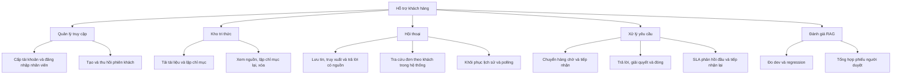
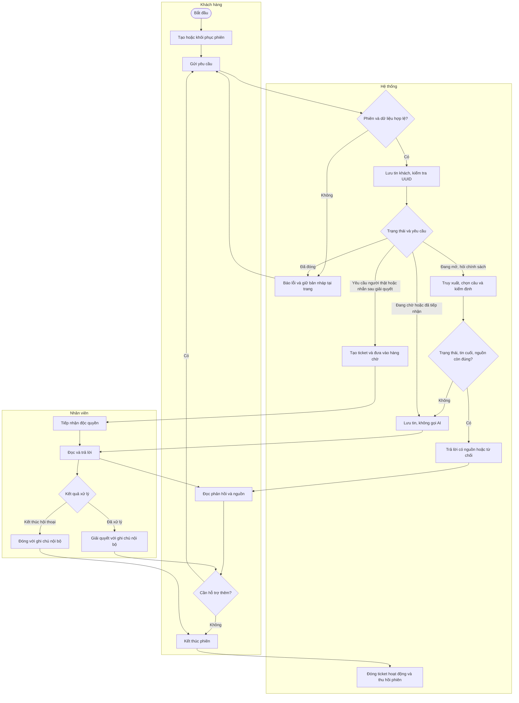
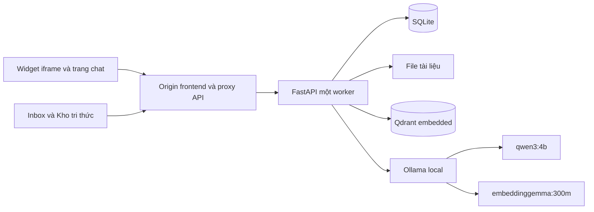
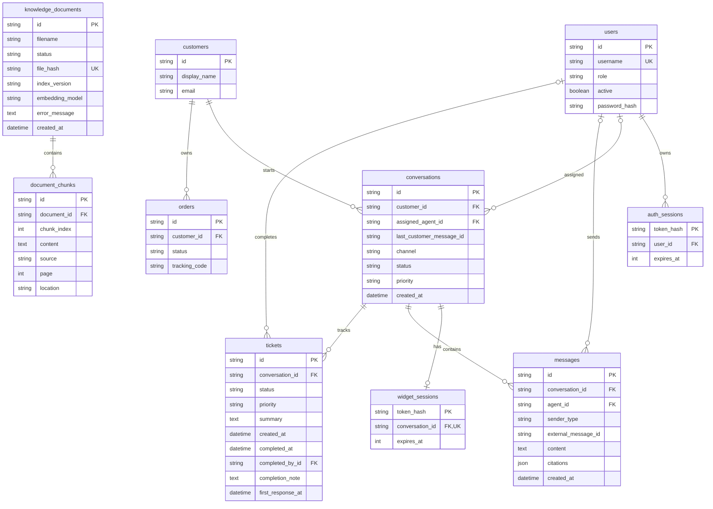
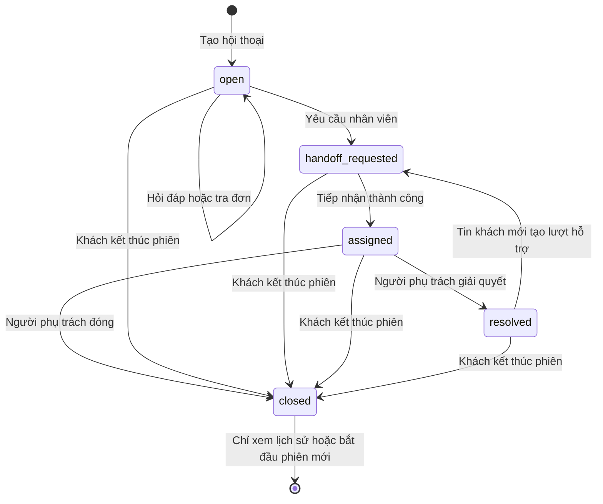
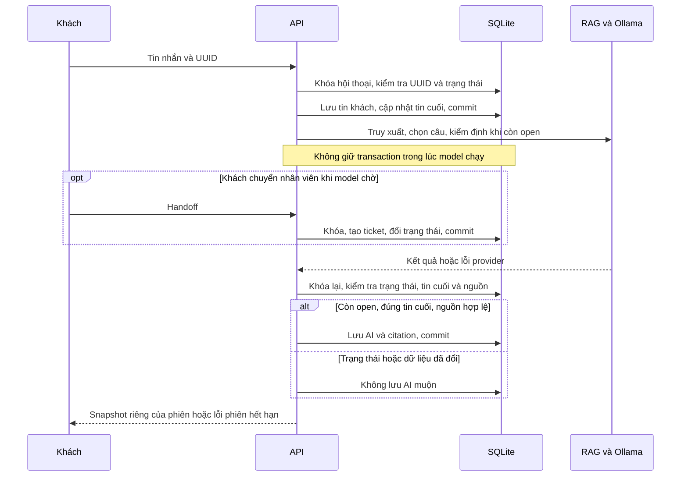
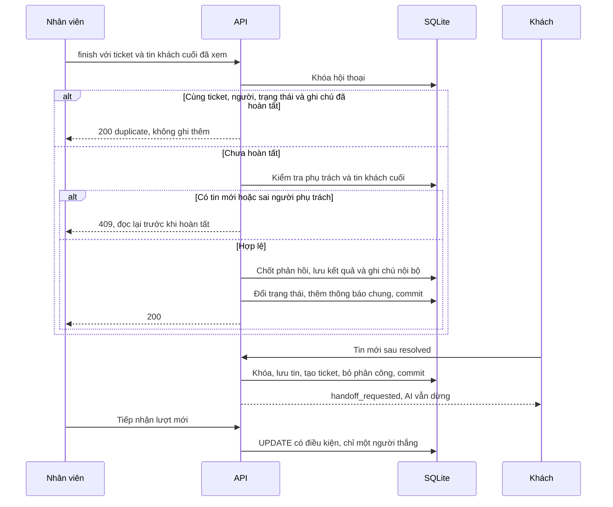

# Thiết kế hệ thống hỗ trợ khách hàng

Ngày đối chiếu: 15/09/2026. Tài liệu mô tả chức năng đang có trên FastAPI/SQLite, React/Vite, Qdrant embedded và Ollama local. Đây là hồ sơ kỹ thuật để người dùng/GVHD duyệt sau; chưa phải xác nhận nghiệm thu. M3 còn chờ người duyệt chất lượng, M4 mới kiểm chứng chức năng local. API chi tiết tại [API.md](API.md), bằng chứng tại [M4_ACCEPTANCE.md](M4_ACCEPTANCE.md).

## Phân rã chức năng BFD

LLM tool calling, kênh xã hội thứ hai, push realtime, OCR và SLA giải quyết thuộc phạm vi dự kiến, không nằm trong các nút đã thực hiện.

## Luồng nghiệp vụ mức 0

Sơ đồ phân làn dưới đây diễn tả nhiệm vụ, điều kiện rẽ nhánh và trao đổi giữa khách, hệ thống, nhân viên. Đây là biểu diễn luồng nghiệp vụ bằng Mermaid để rà soát; chưa phải file BPMN 2.0 có thể nhập vào công cụ mô hình hóa hoặc thực thi.

Khi hội thoại còn mở và có mã đơn, backend dùng hàm tra cứu theo customer_id của hội thoại. Không tìm thấy đơn thuộc khách sẽ chuyển nhân viên; không gọi LLM để tự quyết định tool. Phiên widget tự tạo khách mới, nên tên giống người mua không cấp quyền đơn có sẵn. Handoff là nhận diện theo quy tắc; tóm tắt ticket là trích tối đa tám tin gần nhất, không phải tóm tắt bằng LLM.

## Use Case và quyền

| ID | Tác nhân | Mục tiêu | Điều kiện và kết quả |
|---|---|---|---|
| UC01 | Admin | Cấp tài khoản | Đã đăng nhập; username duy nhất, mật khẩu ít nhất 12 ký tự |
| UC02 | Admin, agent | Đăng nhập, đăng xuất | Tài khoản hoạt động; phiên nhân viên tối đa 8 giờ |
| UC03 | Khách | Bắt đầu, khôi phục, kết thúc chat | Phiên khách tối đa 24 giờ, chỉ một hội thoại; không xác minh chủ đơn |
| UC04 | Khách | Hỏi chính sách có nguồn | Hội thoại open; tin lưu trước model; thiếu bằng chứng trả từ chối |
| UC05 | Admin | Quản lý tài liệu | Tải/lập chỉ mục lại/xóa; staff được xem tài liệu, đoạn nguồn và hỏi thử |
| UC06 | Khách, staff | Chuyển nhân viên | Ticket hoạt động được tái sử dụng; AI ngừng trả lời |
| UC07 | Admin, agent | Tiếp nhận | Hội thoại đang chờ, chưa có người phụ trách; tranh chấp chỉ một người thắng |
| UC08 | Người phụ trách | Trả lời | Hội thoại assigned và assigned_agent_id khớp người đăng nhập |
| UC09 | Người phụ trách | Giải quyết hoặc đóng | Ghi chú bắt buộc, tin khách cuối không đổi; chốt SLA và ghi người/thời điểm |
| UC10 | Khách | Nhắn sau giải quyết | Giữ lịch sử, tạo ticket mới, bỏ phân công cũ và chờ tiếp nhận lại |
| UC11 | Admin, agent | Xem Inbox và SLA | Thấy tất cả hội thoại nội bộ; chưa có tenant/team isolation |
| UC12 | Người duyệt | Chấm chất lượng | Điền bản sao phiếu; CLI chỉ tính nhãn đã duyệt và câu thực chấm |

UC09 dùng kết quả UC07; UC10 phát sinh UC06 mới và không bật lại UC04. Admin có quyền quản lý nhưng UC08/UC09 vẫn yêu cầu phụ trách. Khách không được gọi API nội bộ, không xem ghi chú ticket hoặc retrieval thô. Giao diện dùng luồng trên, backend kiểm tra quyền độc lập.

## Kiến trúc triển khai local

Frontend cần SPA fallback cho /chat và proxy /api cùng origin. Bản Vite build chỉ là tài nguyên tĩnh; backend không tự phục vụ frontend. Cookie SameSite Strict/HttpOnly tách khách và nhân viên, bật Secure ngoài development. Không giữ SQL transaction trong lúc gọi Ollama. Qdrant và giới hạn trong bộ nhớ hiện chỉ hỗ trợ một API worker. Triển khai cloud, sao lưu/khôi phục, tải đồng thời và HTTPS thực tế chưa được nghiệm thu.

## ERD

ERD phản ánh liên kết khai báo trong SQLAlchemy và migration v4. SQLite hiện chưa bật PRAGMA foreign_keys trong cấu hình kết nối; không coi ký hiệu FK là bằng chứng DB cưỡng chế toàn bộ quan hệ. last_customer_message_id là con trỏ logic, không có FK. UUID tin ngoài không có UNIQUE index; chống trùng trong process_message dựa trên khóa ghi hội thoại và tra UUID theo hội thoại. Các state/priority là chuỗi, chưa có CHECK constraint. schema_migrations là bảng hạ tầng với version làm khóa chính.

Citation là snapshot JSON trong Message, không có FK tới chunk; quote lịch sử được giữ khi tài liệu bị xóa, mở nguồn có thể trả 404/409. Hash file có unique index; vector dùng ID chunk và phiên bản chỉ mục để đối chiếu với SQL. Không đồng nhất file, chunk và lịch sử hội thoại thành một nguồn dữ liệu.

## Trạng thái hội thoại

Ticket hoạt động đi từ open sang assigned rồi resolved/closed. Khách kết thúc trước tiếp nhận có thể chuyển trực tiếp open sang closed. Lượt sau tạo ticket mới, không đổi trạng thái ticket cũ. Resolved giữ thông tin phân công cho tới khi tin khách mới bỏ phân công; closed không mở lại. Retry tin cũ sau resolved không làm phát sinh chuyển trạng thái.

## Sequence hỏi đáp và chống AI muộn

## Sequence hoàn tất và tiếp nhận lại

Tin mới thắng khóa trước finish khiến finish bị 409; finish resolved thắng trước khiến tin mới vào lượt mới. Ghi chú không được đưa vào thông báo công khai. Ticket kết thúc chốt first_response_at, kể cả null; phản hồi lượt sau không biến cancelled thành met. Hạn phản hồi cố định urgent/high/normal/low là 5/15/60/240 phút, 24/7 từ tạo ticket, chưa lưu phiên bản chính sách/deadline.

## Giao diện và phần còn thiếu

Màn hình hiện có gồm đăng nhập, Inbox ba vùng, Kho tri thức, trang chat và widget iframe. Inbox polling mỗi ba giây khi hiển thị, giữ bản nháp/lựa chọn, dừng khi tab ẩn hoặc thao tác ghi. Form hoàn tất chỉ hiện cho người phụ trách có ticket hoạt động; xác nhận giải thích hành vi nhắn tiếp. Widget sau resolved cho gửi, sau closed khóa composer và hướng dẫn bắt đầu phiên mới.

QA giao diện ngày 14/09 đã kiểm tra desktop/mobile 390px; các ảnh trong data/runtime là bằng chứng local, không thuộc gói nguồn bắt buộc. Các mockup do người dùng tạo chưa được duyệt hoặc chỉnh sửa trong đợt này. Cần chốt mẫu thiết kế với GVHD, bổ sung BPMN chuẩn nếu biểu mẫu yêu cầu, nghiệm thu người dùng và đo tải trước tuyên bố hoàn tất toàn bộ M2/M4.
